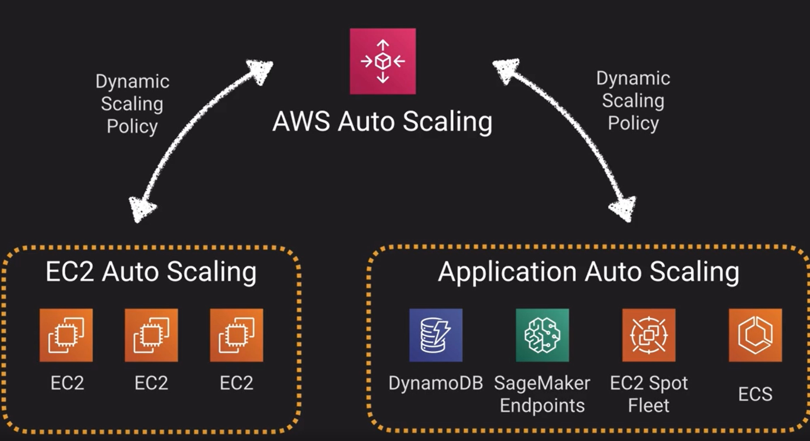

# Scaling
## Horizontally, scale out
- add more instances as demand increases 
- no downtime
- automatic using auto-scaling groups
- (theoretically) unlimited
- opposite scale in

## Vertically, scale up
- add more computing power, CPU, RAM to an existing instance
- require restart
- would require scripting to automate
- limited to instance zone
- opposite scale down

# Auto-Scale

- Amazon EC2 Auto Scaling. To setup scaling groups for EC2 instances healthchecks to remove unhealthy instances.
- Application Auto Scaling. API used to control scaling for resources other than EC2, like Dynamo, ECS, EMR. Provides common way to interact with scalability of other services.
- AWS Auto Scaling - Provides centralized way to manage scalability for whole stacks; Predictive scaling features

### EC2 Auto-Scaling groups
- automatically provides horizontal scaling
- triggered by an event action to either launch or terminate instances
- availability, cost and system metrics can all factor into scaling
- Options
    - Maintain - keep a specific or minimum number of instances
    - manual - use maximum, minimum, or specific number of instances
    - schedule - time based scaling
    - dynamic - based on metric

#### Dynamic scaling policies
- target tracking policy - scale based on predefined or custom metric in relation to a target value. When CPU gets to 70%, scale up
- simple scaling policy. Waits until healthcheck and cool down period expires before evaluating new need
    - default cooldown period 300 second
- step scaling policy - response to scaling needs with more sophistication and logic

## Application Auto Scaling (API)
- target Tracking policy - initiates scaling events to try to track as closely as possible a given target metric
- step scaling policy - based on a metric, adjusts capacity given certain defined threshold
- scheduled scaling policy - initiates scaling events, based on a predefined time, day or date

## Predictive Scaling
can dynamically scale based on learning your load and calculating expected capacity. Uses ML.