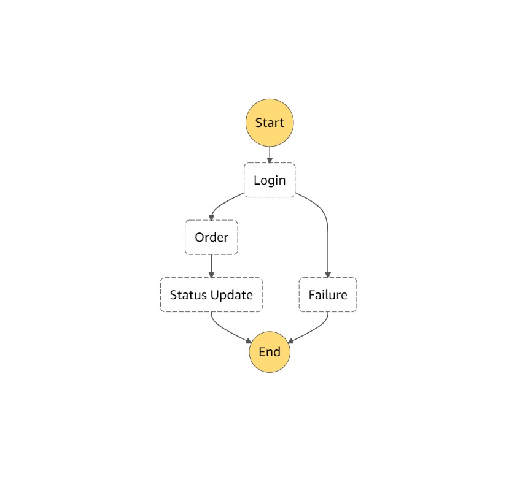

# Lambda

is a compute service where you can upload your code and create a Lambda function.Lambda takes care of provisioning and managing servers that you use to run the code.


Can be used as an event-driven compute service where Lambda get invoked in response to an event. For example, event could be changes to data in a S3, DynamoDb table, HTTP request using API Gateway or API calls using SDK.

## Languages
- NodeJs
- Java
- Python
- Go
- C#

## Price
- requests: 1m - free tier, $0.2 per 1m requests
- duration: starts from beginning of execution till return/termination. Rounded tp 100ms. $0.00001667 per GB-second.

## Features
- no server to manage. compute service, serverless
- continuous scaling. Scales out (not up) automatically.
- 1 event = 1 function
- lambda can trigger other functions, 1 event = x functions if function trigger other functions
- can be used across regions


## [Triggers](https://aws.amazon.com/blogs/architecture/understanding-the-different-ways-to-invoke-lambda-functions/)
### Synchronous 
```—invocation-type RequestResponse```
- HTTP event through API gateway/load balancer
- Cognito
- Alexa
- Other Lambdas

### Asynchronous 
if returns an error it get retry twice

```—invocation-type Event```
- S3 event
- SNS, SES
- CloudWatch events (reoccurring)
- CodeCommit
- CloudFormation

### Poll-Based (stream & queues)
lambda will pol on your behalf

retry based on data expiration

- SQS
- DynamoDb stream event 
- Kinesis

## Version Control
- Lambda can have multiple versions function deployed
- Latest always is going to be marked as $LATEST
- Versions are immutable
- Can split traffic using aliases to different versions
- Cannot split traffic with $latests, unless an alias created for it.
- alias is a pointer to a specific version

# Step Functions

- serverless application visualisation
- SF triggers and tracks each step
- SF logs


## Concurrent Execution
- there is a concurrent execution limit for Lambda
- number of lambdas that can be run per region per account
- default 1k
- exception __TooManyRequestsException__, https status code: 429
- need to contact support through console
- __reserved concurrency__ guarantees that a set number of execution which will always be available for you critical function, however this also acts as a limit

## VPC access
- allow the function to connect to private network
- ```aws lambda update-function-configuration --function-name my-function --vpc-config SubnetIds=subnet-1122aabb,SecurityGroupIds=sg-51530134```
- required VPC credentials
    - private subnet ID
    - security group ID
    - Lambda uses this information to set up ENIs using an available IP address from your private subnet