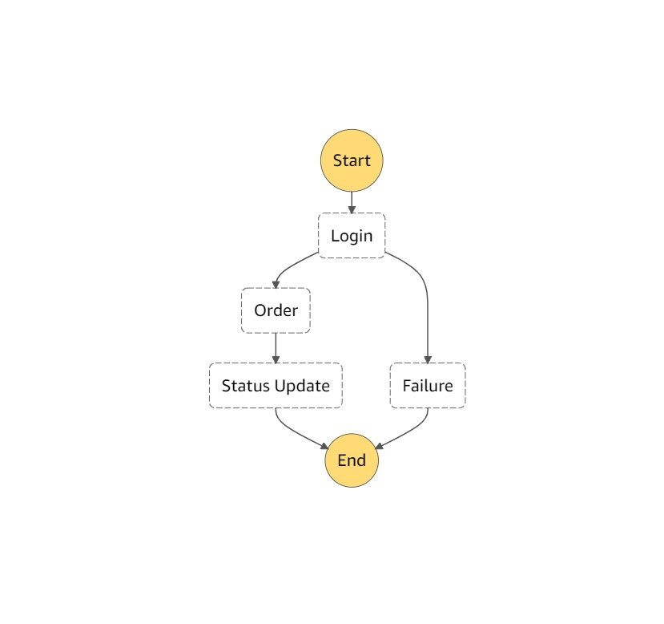

# Step Functions

- serverless application visualisation
- SF triggers and tracks each step
- detailed SF logs
- managed workflow and orchestration platform
- scalable and available
- define you app as a state machine
- create tasks, sequential steps, parallel steps, branching paths or timers
- uses Amazon State Language - declarative JSON
- direct integration with lambda and other services, as well as API
- visual interface describes flow and realtime status
