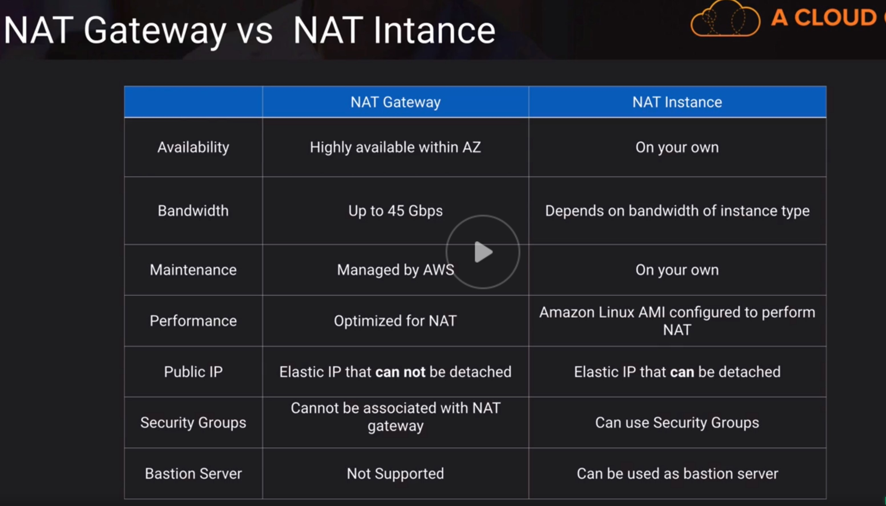

# Internet Geteways

Providing internet to our VPC
## Internet Gateway
- horizontally scaled, redundant and highly available component that allows communication between your VPC and the internet
- no availability risk or bandwidth constraints
- supports IPv4 and IPv6
- if your subnet is associated with a route to the internet, then it is a public subnet
- Purpose 1: Provide route table target for Internet-bound traffic
- Purpose 2: Perform NAT for instances with public IP addresses
- Does not perform NAT for instances with private IP's only

## Egress-Only Internet Gateway
- IPv6 addresses are globally unique and are therefore public by default
- provides outbound Internet access for IPv6 addressed instances
- prevent inbound access to those IPv6 instances
- Stateful - forwards traffic from instance to internet and then sends back the response
- Must create a custom route for ::/0 to the Egress-Only Internet Gateway
- Use Egress-Only Internet Gateway instead of NAT for IPv6

## NAT Instance
- EC2 instance from a special AWS provided AMI
- Translate traffic from many private IP instances to a single public IP and back 
- Doesn't allow public Internet initiated connection into private instances
- Not supported for IPv6 
- NAT instances must live on a public subnet with route to Internet Gateway
- Private instances in private subnet must have route to the NAT instance, usually the default route destination of 0.0.0.0/0

## NAT Gateway
- Fully managed NAT service that replaces needs for NAT instance on EC2
- Must be created in Public subnet
- Uses an Elastic IP for public IP for the life of the Gateway
- Private instances in private subnet must have route to the NAT Gateway, usually the default route destination of 0.0.0.0/0
- Created in specified AZ with redundancy in that zone
- For multi-AZ redundancy, create NAT Gateways in each AZ with routes for private subnets to use the local Gateway
- Up to 5 Gbps bandwidth that can scale up to 45 Gbps
- Can't use a NAT Gateway to access VPC peering, VPN or Direct Connect

