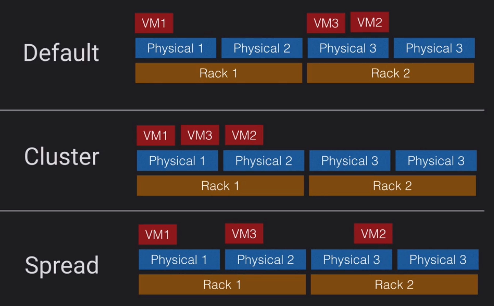
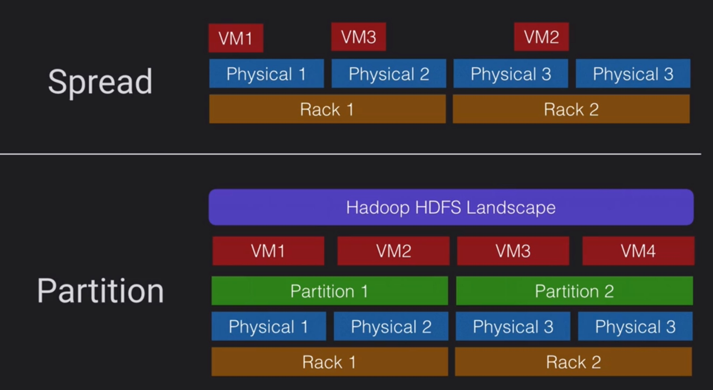

# Placement groups
How we can arrange our instances over the physical hardware

## Clustered
- Instances are placed into a low-latency group within a single AZ
- when need low network latency and.or higher network throughput
- pros. Get the most of Enhanced Network Instances
- cons. Finite capacity, recommend launching all you might need upfront 
## Spread
- Instances spread across underlying hardware
- To reduce risk of simultaneous failure of underlying hardware fails
- pros. can span multiple AZ
- cons. max 7 instances per AZ

## Partition
- Instances are grouped into partitions and spread across racks
- reduce risk of correlated hardware failure for multi-instances workloads
- pros. better for large distributed or replicated workloads than Spread
- cons. Not supposed for Dedicated Hosts