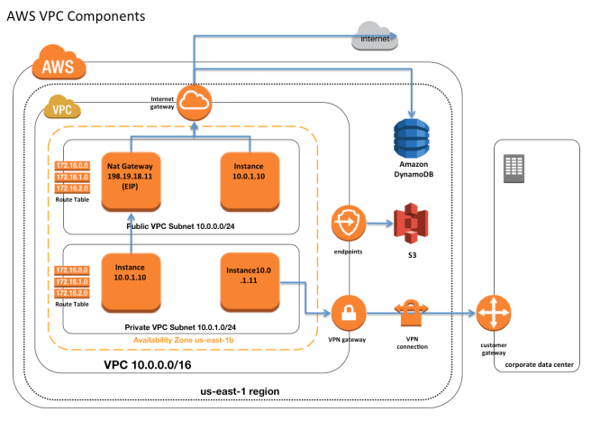

# VPC (Virtual Private Cloud)
[Docs](https://docs.aws.amazon.com/vpc/latest/userguide/VPC_Subnets.html)

a logically isolated section of the AWS Cloud where you can launch AWS resources in a virtual network you define. Full control:
- own IP address, both IPv4 and IPv6
- security groups - stateful
- Network ACL - stateless
- subnets
- route tables configuration
- network gateways
- can create a Hardware VPN connection between your corporate datacenter and you VPC and leverage the AWS cloud as an extension of your corporate datacenter.

[AN INTERACTIVE IP ADDRESS AND CIDR RANGE VISUALIZER](https://cidr.xyz/)

## What we can do with as VPC?
- lunch instance into a subnet of a choice
- assign custom IP address ranges in each subnet
- configure route tables between subnets
- create internet gateway and attach it to out VPC
- much better security control over your AWS resources
- instance security groups
- subnet network access control lists (ACLS)

## Default VPC vc Custom VPC
- default VPC is user friendly, allowing you to immediately deploy instances
- all subnet in default VPC have a route out to the public
- Each EC2 instances has both a public and private IP address

## VPC Peering
- allows to connect VPC with another via direct network route using private IP address
- instance behave as if they were on the same private network
- you can peer VPC with other AWS account as well as with other VPC in the same account
- peer between regions

## Creating VPC
- By default, VPC, route table, network ACL, security group get created
- next step is to create subnet
- one subnet - one availability zone
- in order to make subnet public, need to turn auto-assign public ip address
- in order to allow internet communication, need to create internet gateway and configure route tables. one internet gateway per VPC

## VPC reserved IP addresses
- 10.0.0.0 - network address
- 10.0.0.1 - reserved be AWS for VPC router
- 10.0.0.2 - for Amazon RDS
- 10.0.0.3 - future use
- 10.0.0.255 - VPC doesn't support broadcast so AWS reserves this address

## Network to VPC connectivity
- AWS Managed VPN. Quick and simple. Dependent on internet connection
- AWS Direct Connect - dedicated network connection over private lines straight into AWS backbone. Create VIF to connect to VPC (private VIF). More predictable. 
- AWS Direct Connect + VPN. IPsec VPN over private lines
- AWS VPN CloudHub. Connect locations in a Hub and Spoke manner using AWS's Virtual Private Gateway. Collection of remote offices.
- Software VPN. DIY VPN. You provide your own VPN endpoint and software.
- Transit VPC. Common strategy for connecting geographically disperse VPCs and locations in order to create a global network transit center. Ultimate flexibility, but you must design for additional redundancy.

## VPC to VPC
- peering. Uses AWS backbone without touching internet.  Transitive peering is not supported). 
- software VPN
- Software to AWS managed VPN
- AWS Managed VPN
- AWS Direct Connect
- AWS PrivateLink. AWS-provided network connectivity between VPCs and/or AWS services using interface endpoints. Private Subnet is private.

## VPC endpoint
### Interface Endpoint
- Elastic Network Interface with an Private IP
- Uses DNS entries to redirect traffic
- API Gateway, CloudFormation, CloudWatch, etc.
- Securing by security Group
### Gateway Endpoint
- A gateway that is a target for specific route
- uses prefix lists in the route table to redirect traffic
- S3, DynamoDB
- Securing with VPC Endpoint Policies

## Routing table
- VPC have an implicit router and main routing table
- ou can modify the main routing table or create new tables
- each route table contains a local route for the CIDR block
- most specific route for an address wins