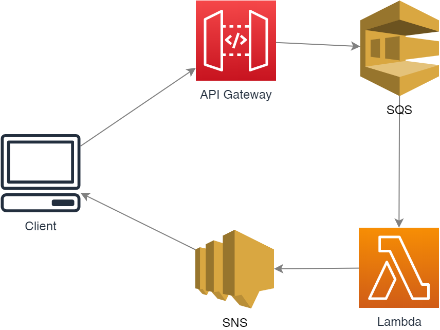

# Webhook. API Gateway async request

1. Trusted client configured with service
2. client submits request, it stored in queue. APIG returns 200OK
3. Backend does work
4. Backend work calls frontend when work is done