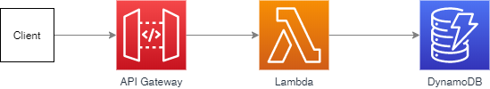
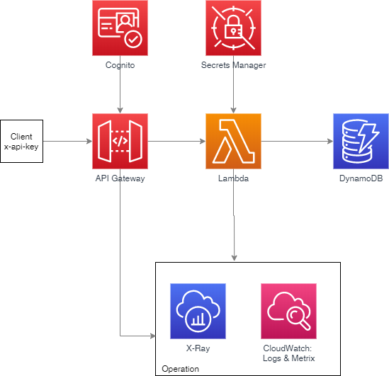

# Comfortable "REST"

## Operation Excellence
- Log to CloudWatch
- Create metrics async with  CloudWatch Embedded Metric Format

## Reliability
- Regulate inbound access rate with api key x-api-key

## Security
- Use Cognito to authorize consumers
- manage secrets with secrets manager

## Performance
- DynamoDb on demand billing
- Regional HTTP2 support

## Cost
Use Lambda Power Tunning for performance/cost optimisation

