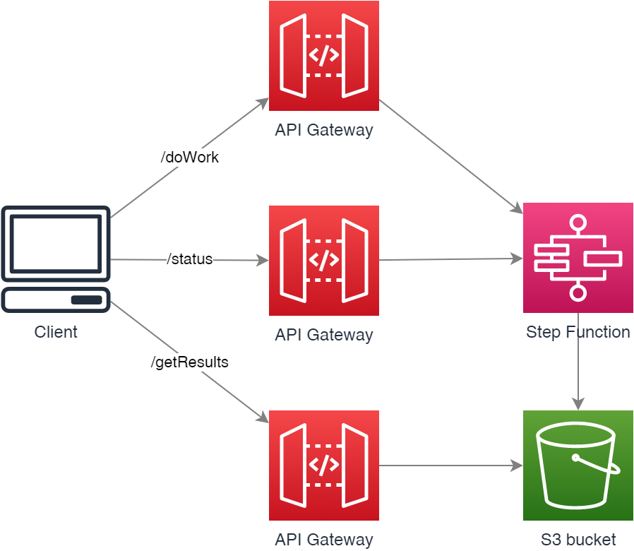

# Polling. API Gateway async response.

1. Client submits request and receives requestID
1. Backend service does work asynchronously updating job status
1. client pools for status of request with that request id and Gateway checks stepfunction execution is job is done
1. client fetches results when work is complete
