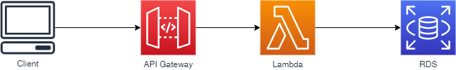
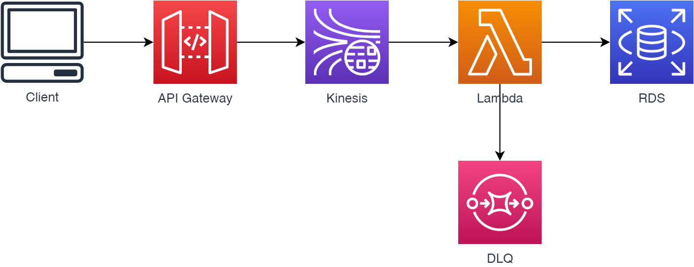

# Webhook
Pattern: Call me, "Maybe"

## Problems
- lambda is too fast, and RDS is slow

Best practice: limit concurrency to protect non-scalable/stateful downstream services.

Better way: Kinesis as a buffer + a better mechanism to limit concurrency. Use Lambda Destinations for failed requests; set max retries
