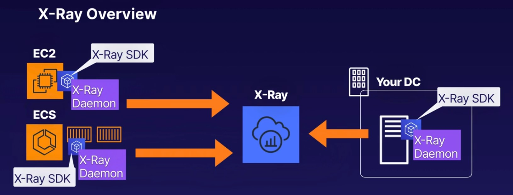

# X-Ray

- interceptors to add to a code to trace incoming HTTP requests
- client handlers to instrument AWS SDK clients that your application uses to call other AWS services
- An HTTP client to use to instrument calls to other internal or external HTTP web services.
- the AWS X-Ray SDK sends the data to the X-Ray daemon which buffers segments in a queue and uploads them to X-Ray in batches
- you need both X-Ray SDK and the X-Ray daemon on your system

## Integrates with
- LB
- Lambda
- API gateway
- ECS
- Beanstalk

## Languages
- Java
- Go
- Nodejs
- Python
- Ruby
- .net

## Configuration
- On premises, EC2 instances, Elastick Beanstalk. Install the X-Ray daemon on your EC2 instance or on-premises server
- Elastic Container Service: Install the X-Ray daemon in its own Docker container on your ECS cluster alongside your app

## Annotation
Indexed key-value pairs to record application specific information, can be searched 