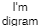

<!-- <a href="http://jgraph.github.io/drawio-github/edit-diagram.html?repo=drawio-github&path=diagram.png" target="_blank">Edit</a> | <a href="https://www.draw.io/#Uhttps%3A%2F%2Fjgraph.github.io%2Fdrawio-github%2Fdiagram.png" target="_blank">Edit As New</a> -->
# Hello

<a href="http://jgraph.github.io/drawio-github/self-editing.svg" target="_blank">self-editing.svg</a>

<a href="./Untitled_Diagram.svg" target="_blank">self-editing.svg</a>

[Edit as New](https://www.draw.io/https://github.com/nelly2k/notes/raw/master/Untitled_Diagram.png)
[Edit](http://jgraph.github.io/drawio-github/edit-diagram.html?repo=notes&path=Untitled_Diagram.png)